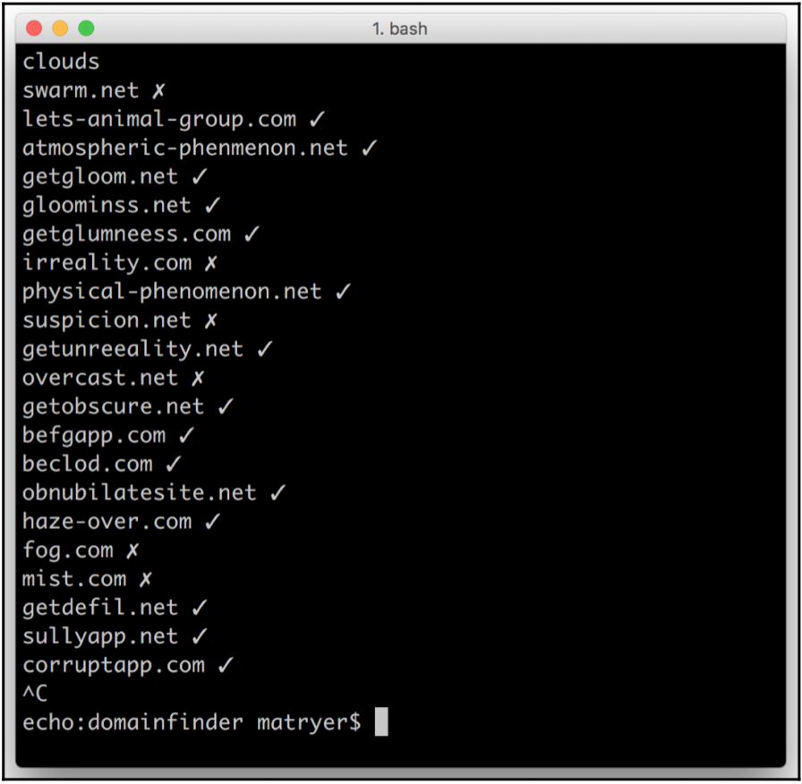

Chapter 04. Command-Line Tools to Find Domain Names
===================================================

## 챕터 요약

### domainFinder 프로그램
    5개의 프로그램으로 구성된 프로그램
    
    임의의 단어를 입력하였을 때, 유사한 이름의 도메인 주소를 생성해주고 이와 일치하는 도메인이 존재하는지 찾아주는 프로그램

### domainFinder 프로그램의 구성

1. synonyms
    * [Big Huge Thesaurus](https://words.bighugelabs.com/api.php) 에서 제공하는 API를 이용하여 입력한 단어의 동의어를 출력해주는 프로그램
    * Request Message의 예시 (api-key는 위 링크에서 받을것)
        * HTTP GET Method를 사용하여 요청
        * http://words.bighugelabs.com/api/2/your-api-key/chat/
        * http://words.bighugelabs.com/api/2/your-api-key/chat/xml
        * http://words.bighugelabs.com/api/2/your-api-key/chat/json
        * http://words.bighugelabs.com/api/2/your-api-key/chat/json?callback=my_callback_function
        * http://words.bighugelabs.com/api/2/your-api-key/chat/php
    * Response Message 예시 (입력 단어가 chat일 경우)
        * confab
        * confabulation
        * schmooze
2. sprinkle
    * 입력받은 단어에 Web 친화적인 접두사, 접미사를 붙여주는 프로그램
        * 접미사로는 app, site, time, hq
        * 접두사로는 get, go, let 
        * 위의 접미사, 접두사 중 하나를 랜덤으로 선정
    * 결과값
        * confabapp
        * goconfabulation
        * schmooze time
3. coolify
    * 입력된 단어에 존재하는 모음에 대하여 갯수를 늘리거나 지워주는 프로그램
    * 결과값
        * confabaapp
        * goconfabulatioon
        * schmoooze time
4. domainify
    * 입력된 단어를 타당한 도메인 이름으로 변경해주는 프로그램
        * 띄어쓰기는 '-' 로 변경
        * com 또는 net을 붙여줌
    * 결과값
        * confabaapp.com
        * goconfabulatioon.net
        * schmoooze-time.com
5. available
    * 입력된 도메인 이름에 대하여 WHOIS Server를 통해 해당 도메인이 존재하는지를 확인하는 프로그램
    * raw TCP 방식으로 com.whois-servers.net의 port 43번에 접근하여 결과값을 받아옴
        * Golang의 net 패키지에서 제공하는 TCP 함수인 ``func Dial(network, address string)(Conn, error)`` 사용

### domainFinder 프로그램 실행 결과



------------------------------------------------------------------------------------------------------------

## 상세 설명

1. synonyms 프로그램
    * Thesaurus 통신 시에 Response Message 형식 (입력 단어: love)
    ``` json
    {
        "noun": {
            "syn": [
                "passion",
                "beloved",
                "dear"
            ]
        },
        "verb": {
            "syn": [
                "love",
                "roll in the hay",
                "make out"
            ]
        },
        "ant": [
            "hate"
        ]
    }
    ```
    * Thesaurus 통신 시에 Response 처리를 위한 함수
    ``` go
    package thesaurus

    import (
        "encoding/json"
        "errors"
        "net/http"
    )

    type BigHugh struct {
        APIKey string
    }

    type synonyms struct {
        Noun *words `json:"noun"`
        Verb *words `json:"verb"`
    }

    type words struct {
        Syn []string `json:"syn"`
    }

    // 입력 단어의 동의어를 Response Message의 noun, verb 순서대로 나열한 문자열 배열을 출력 (위의 Response Message 형식 참조)
    func (b *BigHugh) Synonyms(term string) ([]string, error) {
        var syns []string
        response, err := http.Get("http://words.bighugelabs.com/api/2/" + b.APIKey + "/" + term + "/json")
        if err != nil {
            return syns, errors.New("bighugh: Failed when looking for synonyms for \"" + term + "\"" + err.Error())
        }
        var data synonyms
        defer response.Body.Close()
        if err := json.NewDecoder(response.Body).Decode(&data); err != nil {
            return syns, err
        }
        if data.Noun != nil {
            syns = append(syns, data.Noun.Syn...)
        }
        if data.Verb != nil {
            syns = append(syns, data.Verb.Syn...)
        }
        return syns, nil
    }
    ```
    * main.go Source File
    ``` go
    package main

    import (
        "bufio"
        "fmt"
        "log"
        "os"

        // Big Huge Thesaurus API를 위한 Package
        "github.com/matryer/goblueprints/chapter4/thesaurus"
    )

    func main() {

        apiKey := os.Getenv("BHT_APIKEY")
        thesaurus := &thesaurus.BigHugh{APIKey: apiKey}
        s := bufio.NewScanner(os.Stdin)

        for s.Scan() {
            word := s.Text()
            syns, err := thesaurus.Synonyms(word)
            if err != nil {
                log.Fatalln("Failed when looking for synonyms for \""+word+"\"", err)
            }
            if len(syns) == 0 {
                log.Fatalln("Couldn't find any synonyms for \"" + word + "\"")
            }
            for _, syn := range syns {
                fmt.Println(syn)
            }
        }
    }
    ```
2. sprinkle 프로그램
    * main.go Source File
    ``` go
    package main

    import (
        "bufio"
        "fmt"
        "math/rand"
        "os"
        "strings"
        "time"
    )

    const otherWord = "*"

    var transforms = []string{
        otherWord,
        otherWord,
        otherWord,
        otherWord,
        otherWord + "app",
        otherWord + "site",
        otherWord + "time",
        "get" + otherWord,
        "go" + otherWord,
        "lets " + otherWord,
    }

    func main() {
        rand.Seed(time.Now().UTC().UnixNano())
        s := bufio.NewScanner(os.Stdin)
        for s.Scan() {
            // 입력받은 단어에 대하여 transforms 배열의 Element 중 하나를 랜덤으로 불러옴
            t := transforms[rand.Intn(len(transforms))]
            fmt.Println(strings.Replace(t, otherWord, s.Text(), -1))
        }
    }
    ```
3. coolify 프로그램
    * main.go Source File
    ``` go
    package main

    import (
        "bufio"
        "fmt"
        "math/rand"
        "os"
        "time"
    )

    const (
        duplicateVowel bool = true
        removeVowel    bool = false
    )

    func randBool() bool {
        return rand.Intn(2) == 0
    }

    func main() {
        rand.Seed(time.Now().UTC().UnixNano())
        s := bufio.NewScanner(os.Stdin)
        for s.Scan() {
            word := []byte(s.Text())
            if randBool() {
                var vI = -1
                for i, char := range word {
                    switch char {
                    case 'a', 'e', 'i', 'o', 'u', 'A', 'E', 'I', 'O', 'U':
                        // 입력받은 단어의 임의의 모음의 Index를 저장
                        if randBool() {
                            vI = i
                        }
                    }
                }
                // 임의의 Index에 대하여 해당 단어를 지우거나 하나 더 복사함
                if vI >= 0 {
                    switch randBool() {
                    case duplicateVowel:
                        word = append(word[:vI+1], word[vI:]...)
                    case removeVowel:
                        word = append(word[:vI], word[vI+1:]...)
                    }
                }
            }
            fmt.Println(string(word))
        }
    }
    ```
4. domainify 프로그램
    * main.go Source File
    ``` go
    package main

    import (
        "bufio"
        "fmt"
        "math/rand"
        "os"
        "strings"
        "time"
        "unicode"
    )

    var tlds = []string{"com", "net"}

    const allowedChars = "abcdefghijklmnopqrstuvwxyz0123456789_-"

    func main() {
        rand.Seed(time.Now().UTC().UnixNano())
        s := bufio.NewScanner(os.Stdin)
        for s.Scan() {
            text := strings.ToLower(s.Text())
            var newText []rune
            for _, r := range text {
                // Space를 '-'로 대체
                if unicode.IsSpace(r) {
                    r = '-'
                }
                if !strings.ContainsRune(allowedChars, r) {
                    continue
                }
                newText = append(newText, r)
            }
            // .com 또는 .net을 입력된 단어 뒤에 붙임
            fmt.Println(string(newText) + "." +
                tlds[rand.Intn(len(tlds))])
        }
    }
    ```

5. available 프로그램
    * main.go Source File
    ``` go
    package main

    import (
        "bufio"
        "fmt"
        "log"
        "net"
        "os"
        "strings"
        "time"
    )

    var marks = map[bool]string{true: "✓", false: "✗"}

    func main() {
        s := bufio.NewScanner(os.Stdin)
        for s.Scan() {
            domain := s.Text()
            fmt.Print(domain, " ")
            exist, err := exists(domain)
            if err != nil {
                log.Fatalln(err)
            }
            fmt.Println(marks[!exist])
            time.Sleep(1 * time.Second)
        }
    }

    func exists(domain string) (bool, error) {
        const whoisServer string = "com.whois-servers.net"
        conn, err := net.Dial("tcp", whoisServer+":43")
        if err != nil {
            return false, err
        }
        defer conn.Close()
        conn.Write([]byte(domain + "\r\n"))
        scanner := bufio.NewScanner(conn)
        for scanner.Scan() {
            if strings.Contains(strings.ToLower(scanner.Text()), "no match") {
                return false, nil
            }
        }
        return true, nil
    }
    ```

6. domainfinder 프로그램
    * main.go Source File
    ``` go
    package main

    import (
        "log"
        "os"
        "os/exec"
    )

    var cmdChain = []*exec.Cmd{
        exec.Command("lib/synonyms"),
        exec.Command("lib/sprinkle"),
        exec.Command("lib/coolify"),
        exec.Command("lib/domainify"),
        exec.Command("lib/available"),
    }

    func main() {

        cmdChain[0].Stdin = os.Stdin
        cmdChain[len(cmdChain)-1].Stdout = os.Stdout

        for i := 0; i < len(cmdChain)-1; i++ {
            thisCmd := cmdChain[i]
            nextCmd := cmdChain[i+1]
            stdout, err := thisCmd.StdoutPipe()
            if err != nil {
                log.Fatalln(err)
            }
            nextCmd.Stdin = stdout
        }

        for _, cmd := range cmdChain {
            if err := cmd.Start(); err != nil {
                log.Fatalln(err)
            } else {
                defer cmd.Process.Kill()
            }
        }

        for _, cmd := range cmdChain {
            if err := cmd.Wait(); err != nil {
                log.Fatalln(err)
            }
        }

    }
    ```
    * build.sh
    ``` sh
    #!/bin/bash
    echo Building domainfinder...
    go build -o domainfinder
    echo Building synonyms...
    cd ../synonyms
    go build -o ../domainfinder/lib/synonyms
    echo Building available...
    cd ../available
    go build -o ../domainfinder/lib/available
    echo Building sprinkle...
    cd ../sprinkle
    go build -o ../domainfinder/lib/sprinkle
    echo Building coolify...
    cd ../coolify
    go build -o ../domainfinder/lib/coolify
    echo Building domainify...
    cd ../domainify
    go build -o ../domainfinder/lib/domainify
    echo Done.
    ```

------------------------------------------------------------------------------------------------------------

## 본 챕터에서 주목해서 봐야할 내용

1. 본 챕터의 주 목적은 한 프로그램의 여러 기능들을 모듈화하고 이를 결합하는 방법을 학습하는 것입니다.
2. 우선 각 프로그램에 들어갈 기능들에 대하여 충분히 숙달되어야합니다.
    * bufio를 통한 입출력 기능
    * 문자열 처리 및 rand 함수
    * HTTP 통신
    * raw TCP 통신
3. os/exec 패키지를 사용하여 여러 프로그램을 라이브러리화하여 일련으로 실행하는 방법을 배울 수 있습니다.
4. 추가적으로 쉘 스크립트에 대한 이해가 선행되면 더욱 좋을 듯 합니다.